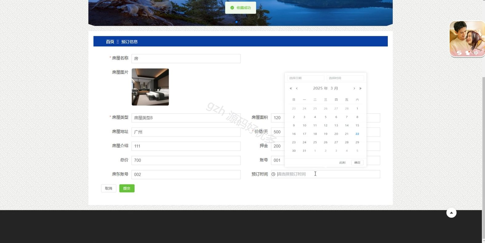

# springbootA387D
springbootA387D民宿订购管理系统
## 查看主页获取源码

### 一、关键词

房源管理、入住管理、预定管理

 

### 二、作品包含

源码+数据库+设计文档万字+全套环境和工具资源+部署教程

 

### 三、项目技术

前端技术：Html、Css、Js、Vue3.0、Element-plus
后端技术：Java、SpringBoot3.0、MyBatis

  

 

### 四、运行环境（以下版本亲测，其他版本未知，请自测）

开发工具：IDEA/eclipse  + VSCODE

数据库：MySQL5.7（最低要5.7版本）

数据库管理工具：Navicat10以上版本

环境配置软件： jdk17 + Maven3.6.3

前端Nodejs：20

浏览器：谷歌浏览器

 

### 五、项目介绍

项目编号：springbootA387D

民宿订购管理系统是用于帮助民宿经营者实现房源管理、订单处理、客户信息维护等功能，以提升民宿运营效率与服务质量的数字化系统。

角色：管理员、用户、房东

管理员：首页、管理员管理、房源信息管理、轮播图管理、房东管理、入住信息管理、新闻资讯管理、预订信息管理、菜单管理、房源类型管理、评价信息管理、用户管理、取消信息管理。

用户：首页、新闻资讯、房源信息、个人中心、修改密码、取消信息、入住信息、预订信息、评价信息、我的收藏。

房东：首页、取消信息管理、房源信息管理、入住信息管理、预订信息管理、评价信息管理。

 

### 六、运行截图

